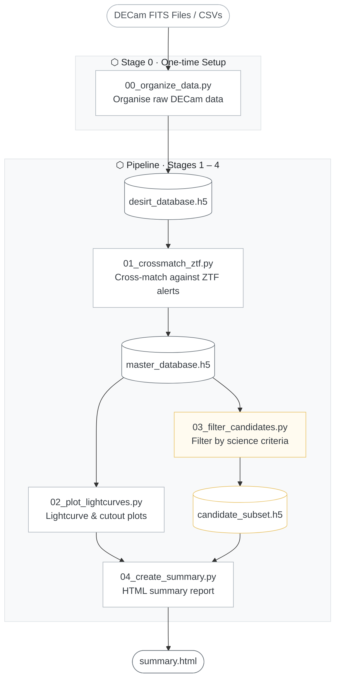

<details>
<summary> HDF5 Database Schema</summary>
A sample HDF5 file structure for a single source in the DESIRT master database is shown below. Each source is stored as a group named by its coordinates (e.g., `/A202502031447311m004707`), containing attributes for RA and Dec, and datasets for lightcurve data and image cutouts.
```bash
[salgundi@bridges2-login014 results]$ h5dump -A -g /A202502031447311m004707 desirt_master_database_20260217_184644.h5
HDF5 "desirt_master_database_20260217_184644.h5" {
GROUP "/A202502031447311m004707" {
   ATTRIBUTE "dec" {
      DATATYPE  H5T_IEEE_F64LE
      DATASPACE  SCALAR
      DATA {
      (0): -0.785369
      }
   }
   ATTRIBUTE "ra" {
      DATATYPE  H5T_IEEE_F64LE
      DATASPACE  SCALAR
      DATA {
      (0): 221.88
      }
   }
   DATASET "difference_image" {
      DATATYPE  H5T_IEEE_F32LE
      DATASPACE  SIMPLE { ( 48, 121, 121 ) / ( 48, 121, 121 ) }
   }
   DATASET "filters" {
      DATATYPE  H5T_STRING {
         STRSIZE 1;
         STRPAD H5T_STR_NULLPAD;
         CSET H5T_CSET_ASCII;
         CTYPE H5T_C_S1;
      }
      DATASPACE  SIMPLE { ( 48 ) / ( 48 ) }
   }
   DATASET "mag_alt" {
      DATATYPE  H5T_IEEE_F64LE
      DATASPACE  SIMPLE { ( 48 ) / ( 48 ) }
   }
   DATASET "mag_fphot" {
      DATATYPE  H5T_IEEE_F64LE
      DATASPACE  SIMPLE { ( 48 ) / ( 48 ) }
   }
   DATASET "magerr_alt" {
      DATATYPE  H5T_IEEE_F64LE
      DATASPACE  SIMPLE { ( 48 ) / ( 48 ) }
   }
   DATASET "magerr_fphot" {
      DATATYPE  H5T_IEEE_F64LE
      DATASPACE  SIMPLE { ( 48 ) / ( 48 ) }
   }
   DATASET "mjds" {
      DATATYPE  H5T_IEEE_F64LE
      DATASPACE  SIMPLE { ( 48 ) / ( 48 ) }
   }
   DATASET "science_image" {
      DATATYPE  H5T_IEEE_F32LE
      DATASPACE  SIMPLE { ( 48, 121, 121 ) / ( 48, 121, 121 ) }
   }
   DATASET "template_image" {
      DATATYPE  H5T_IEEE_F32LE
      DATASPACE  SIMPLE { ( 48, 121, 121 ) / ( 48, 121, 121 ) }
   }
}
}
```
</details>