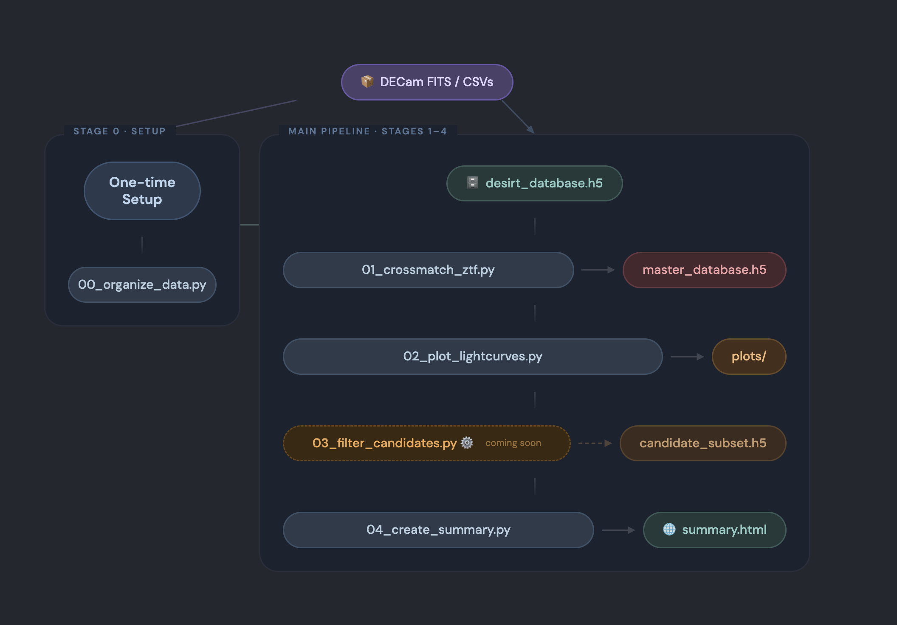

# DESIRT Lightcurves Pipeline

A comprehensive data processing pipeline for organizing, crossmatching, and visualizing transient candidates from the DESIRT (DECam) survey with ZTF (Zwicky Transient Facility) alerts.

## Table of Contents

- [Overview](#overview)
- [Features](#features)
- [Pipeline Architecture](#pipeline-architecture)
- [Installation](#installation)
- [Quick Start](#quick-start)
- [Usage](#usage)
- [Database Schema](#database-schema)
- [Output Products](#output-products)
- [Configuration](#configuration)
- [Contributing](#contributing)

## Overview

The DESIRT Lightcurves Pipeline is designed to process fast transient candidates discovered by the DECam Intensive Rapid Transient (DESIRT) survey. The pipeline:

1. **Organizes** DECam FITS files into an efficient HDF5 database
2. **Crossmatches** DESIRT candidates with ZTF alerts via Kowalski
3. **Generates** publication-quality lightcurves combining multi-filter photometry
4. **Creates** interactive HTML summaries with cutout images
5. **Enables** rapid candidate vetting.

This pipeline is optimized for large-scale processing on HPC clusters and supports parallel processing of thousands of transient candidates.

## Features

- **Memory-Efficient Processing**: Batch processing of large FITS datasets without memory overflow
- **Multi-Survey Integration**: combines DECam and ZTF photometry
- **Parallel Processing**: Multi-core support for faster data processing
- **Interactive Visualizations**: Modern HTML summaries with searchable, sortable tables
- **Comprehensive Logging**: Timestamped logs for debugging and monitoring
- **HDF5 Storage**: Efficient data storage with compression
- **Automated Workflows**: SLURM batch scripts for Bridges2

## Pipeline Architecture



### Pipeline Stages

```
Raw FITS Files → HDF5 Database → ZTF Crossmatch → Candidates Filtering → Lightcurve Plots → HTML Summary
     (00)            (01)              (02)               (03)(dev)                     (04)
```

1. **Stage 00 - Data Organization** (`src/00_organize_data.py`)
   - Reads DECam FITS files containing photometry and cutout images
   - Extracts lightcurve data (MJD, filters, magnitudes, errors)
   - Organizes data by object ID into HDF5 master database
   - Sorts time-series data and applies compression

2. **Stage 01 - ZTF Crossmatching** (`src/01_crossmatch_ztf.py`)
   - Queries Kowalski for ZTF alerts within specified search radius
   - Matches DESIRT coordinates with ZTF object positions
   - Retrieves ZTF photometry and cutout images
   - Appends ZTF data to existing HDF5 database

3. **Stage 03 (being developed) - Candidates Filtering**
   - Implements criteria to filter candidates based on lightcurve properties
   - basic filters can be written in a file and passed as a argument to the script.
   - The output will be a simple text file with the list of candidates that pass the filtering criteria.
   - This list can be used to fetch the relevant lightcurves and cutouts for the candidates that pass the filtering criteria.
   - will be run in a differnt instance in a different html file to avoid confusion with the main summary page.

4. **Stage 02 - Lightcurve Plotting** (`src/02_plot_lightcurves.py`)
   - Generates combined DECam + ZTF lightcurves
   - Creates cutout image panels (science, template, difference)
   - Produces PNG plots for individual objects or full catalog
   - Color-codes different filters for easy interpretation

5. **Stage 04 - Summary Creation** (`src/04_create_summary.py`)
   - Builds interactive HTML summary page
   - Displays lightcurves and cutouts in organized table
   - Provides links to external resources (Fritz)
   - Enables search and sort functionality

## Installation

### Requirements

- Python 3.11+
- Access to Kowalski API (for ZTF crossmatching)
- Sufficient storage for HDF5 databases (~GB per 1000 objects)

### Setup

1. **Clone the repository:**
```bash
git clone <repository-url> #FIXME original link
cd desirt_lightcurves
```

2. **Install dependencies:**
```bash
pip install -r requirements.txt
```

Or using `uv`:
```bash
uv sync
```

3. **Configure Kowalski credentials:**

Edit `./utils/kowalski_credentials.json` with your credentials:

```json
{
    "username": "your_username",
    "password": "your_password",
    "protocol": "https",
    "host": "kowalski.caltech.edu",
    "port": 443,
    "api_token": "your_api_token"
}
```

## Quick Start

### Basic Workflow

```bash
# 1. Organize DESIRT data into HDF5 database

# There will be no need to run this 97% of the times. A separate script will be added to read just the recent database and append it to existing one.
python src/00_organize_data.py \
    --data ./data/candidate_fits_files.txt \
    --n_workers 8 \
    --batch_size 1000

# 2. Crossmatch with ZTF alerts
python src/01_crossmatch_ztf.py \
    --desirt_database ./results/databases/desirt_master_database_*.h5 \
    --kowalski_creds ./utils/kowalski_credentials.json \
    --search_radius 3.0

# 3. Generate lightcurve plots
python src/02_plot_lightcurves.py \
    --database ./results/databases/desirt_master_database_*.h5 \
    --plot_all

# 4. Create HTML summary
python src/04_create_summary.py \
    --database ./results/databases/desirt_master_database_*.h5
```

### View Results

Currently, the best and recommended way to view the results is to open the generated HTML summary in your web browser. This summary provides an interactive interface to explore the lightcurves and cutout images for each candidate.
Open the generated HTML summary in your browser:
```bash
open ./results/summaries/desirt_summary_*.html
```

Or use the utility viewer:
```bash
python utils/view_summary.py
```

## Usage

### Stage 00: Organize Data

```bash
python src/00_organize_data.py \
    --data <path_to_fits_list.txt> \
    --n_workers <num_cores> \
    --batch_size <files_per_batch>
```

**Arguments:**
- `--data`: Text file containing paths to FITS files (one per line)
- `--n_workers`: Number of parallel workers (default: CPU count - 1)
- `--batch_size`: FITS files per batch to control memory usage (default: 1000)

**Output:**
- `./results/databases/desirt_master_database_YYYYMMDD_HHMMSS.h5`
- `./logs/log_from_run_YYYYMMDD_HHMMSS.log`

### Stage 01: ZTF Crossmatch

```bash
python src/01_crossmatch_ztf.py \
    --desirt_database <path_to_h5_database> \
    --kowalski_creds <path_to_credentials.json> \
    --projections <path_to_projections.json> \
    --search_radius <radius_in_arcsec>
```

**Arguments:**
- `--desirt_database`: Path to HDF5 database from Stage 00
- `--kowalski_creds`: Path to Kowalski credentials JSON (default: `./utils/kowalski_credentials.json`)
- `--projections`: Path to projection fields JSON (optional)
- `--search_radius`: Crossmatch radius in arcseconds (default: 3.0)

**Output:**
- Updates HDF5 database with ZTF crossmatch data
- `./results/ztf_crossmatch_summary_YYYYMMDD_HHMMSS.json`
- `./logs/log_ztfcrossmatch_YYYYMMDD_HHMMSS.log`

### Stage 02: Plot Lightcurves

```bash
# Plot all objects
python src/02_plot_lightcurves.py \
    --database <path_to_h5_database> \
    --plot_all

# Plot specific object
python src/02_plot_lightcurves.py \
    --database <path_to_h5_database> \
    --objid <object_id>
```

**Arguments:**
- `--database`: Path to HDF5 database
- `--plot_all`: Plot all objects in database
- `--objid`: Plot specific DESIRT object ID
- `--output_dir`: Base output directory (default: `./results/plots`)

**Output:**
- `./results/plots/lightcurves/<objid>_lc.png`
- `./results/plots/cutouts/<objid>_cutout_decam.png`
- `./results/plots/cutouts/<objid>_cutout_ztf.png`
- `./logs/log_plot_lightcurves_YYYYMMDD_HHMMSS.log`

### Stage 04: Create Summary

```bash
python src/04_create_summary.py \
    --database <path_to_h5_database> \
    --plots_dir ./results/plots \
    --output_dir ./results/summaries
```

**Arguments:**
- `--database`: Path to HDF5 database
- `--plots_dir`: Directory containing plots (default: `./results/plots`)
- `--output_dir`: Output directory for HTML (default: `./results/summaries`)

**Output:**
- `./results/summaries/desirt_summary_YYYYMMDD_HHMMSS.html`
- `./logs/log_create_summary_YYYYMMDD_HHMMSS.log`

### HPC Batch Processing

For large datasets on SLURM clusters:

```bash
# Submit batch job
sbatch scripts/submit_slurmjob.sh

# Check job status
bash scripts/check_slurm_status.sh

# Run full pipeline
bash scripts/batch_runs.sh
```

## Database Schema

### HDF5 Master Database Structure

Each DESIRT object is stored as an HDF5 group with the following structure:

```
/OBJID (e.g., /A202502031447311m004707)
│
├── Attributes
│   ├── ra: float64          # Right Ascension (degrees)
│   └── dec: float64         # Declination (degrees)
│
├── DESIRT Data (Datasets)
│   ├── mjds: float64[N]              # Modified Julian Dates
│   ├── filters: string[N]            # Filter names (g, r, i, z, Y)
│   ├── mag_alt: float64[N]           # ALT photometry magnitudes
│   ├── magerr_alt: float64[N]        # ALT magnitude errors
│   ├── mag_fphot: float64[N]         # Forced photometry magnitudes
│   ├── magerr_fphot: float64[N]      # Forced photometry errors
│   ├── science_image: float32[N,121,121]     # Science cutouts
│   ├── template_image: float32[N,121,121]    # Template cutouts
│   └── difference_image: float32[N,121,121]  # Difference cutouts
│
└── ztf_crossmatches/ (Group, if ZTF matches exist)
    │
    ├── Attributes
    │   ├── search_radius_arcsec: float
    │   ├── num_alerts: int
    │   └── crossmatch_date: string
    │
    └── ztf_000_<ZTF_OBJID>/ (Subgroup per ZTF object)
        │
        ├── Attributes
        │   ├── objectId: string
        │   ├── num_detections: int
        │   ├── filters_present: int[]
        │   └── [other ZTF metadata]
        │
        └── Datasets
            ├── ztf_mjd: float64[M]
            ├── ztf_mag: float64[M]
            ├── ztf_magerr: float64[M]
            ├── ztf_fid: int[M]           # Filter ID (1=g, 2=r, 3=i)
            ├── ztf_ra: float64[M]
            ├── ztf_dec: float64[M]
            ├── science_image: compressed
            ├── template_image: compressed
            └── difference_image: compressed
```

### Example: Inspect Database

```bash
[salgundi@bridges2-login014 results]$ h5dump -A -g /A202502031447311m004707 desirt_master_database_20260217_184644.h5
HDF5 "desirt_master_database_20260217_184644.h5" {
GROUP "/A202502031447311m004707" {
   ATTRIBUTE "dec" {
      DATATYPE  H5T_IEEE_F64LE
      DATASPACE  SCALAR
      DATA {
      (0): -0.785369
      }
   }
   ATTRIBUTE "ra" {
      DATATYPE  H5T_IEEE_F64LE
      DATASPACE  SCALAR
      DATA {
      (0): 221.88
      }
   }
   DATASET "difference_image" {
      DATATYPE  H5T_IEEE_F32LE
      DATASPACE  SIMPLE { ( 48, 121, 121 ) / ( 48, 121, 121 ) }
   }
   DATASET "filters" {
      DATATYPE  H5T_STRING {
         STRSIZE 1;
         STRPAD H5T_STR_NULLPAD;
         CSET H5T_CSET_ASCII;
         CTYPE H5T_C_S1;
      }
      DATASPACE  SIMPLE { ( 48 ) / ( 48 ) }
   }
   DATASET "mag_alt" {
      DATATYPE  H5T_IEEE_F64LE
      DATASPACE  SIMPLE { ( 48 ) / ( 48 ) }
   }
   DATASET "mag_fphot" {
      DATATYPE  H5T_IEEE_F64LE
      DATASPACE  SIMPLE { ( 48 ) / ( 48 ) }
   }
   DATASET "magerr_alt" {
      DATATYPE  H5T_IEEE_F64LE
      DATASPACE  SIMPLE { ( 48 ) / ( 48 ) }
   }
   DATASET "magerr_fphot" {
      DATATYPE  H5T_IEEE_F64LE
      DATASPACE  SIMPLE { ( 48 ) / ( 48 ) }
   }
   DATASET "mjds" {
      DATATYPE  H5T_IEEE_F64LE
      DATASPACE  SIMPLE { ( 48 ) / ( 48 ) }
}
DATASET "science_image" {
      DATATYPE  H5T_IEEE_F32LE
      DATASPACE  SIMPLE { ( 48, 121, 121 ) / ( 48, 121, 121 ) }
   }
   DATASET "template_image" {
      DATATYPE  H5T_IEEE_F32LE
      DATASPACE  SIMPLE { ( 48, 121, 121 ) / ( 48, 121, 121 ) }
    }
}
```

## Output Products

### 1. HDF5 Master Database
- **Location:** `./results/databases/`
- **Format:** Compressed HDF5
- **Contents:** All photometry, metadata, and cutout images
- **Size:** ~1-5 GB per 1000 objects (depends on epochs)

### 2. Lightcurve Plots
- **Location:** `./results/plots/lightcurves/`
- **Format:** PNG (150 DPI)
- **Contents:** Multi-filter lightcurves with DECam and ZTF data
- **Features:** Color-coded filters, error bars, inverted magnitude axis

### 3. Cutout Images
- **Location:** `./results/plots/cutouts/`
- **Format:** PNG (150 DPI)
- **Types:**
  - `*_cutout_decam.png`: DECam science/template/difference
  - `*_cutout_ztf.png`: ZTF science/template/difference
- **Features:** Central marker, percentile scaling

### 4. HTML Summary
- **Location:** `./results/summaries/`
- **Format:** Self-contained HTML
- **Features:**
  - Interactive table with search/sort
  - Embedded lightcurves and cutouts
  - Links to external catalogs (Fritz)
  - Match statistics
  - Responsive design

### 5. Log Files
- **Location:** `./logs/`
- **Format:** Plain text with timestamps
- **Types:**
  - `log_from_run_*.log`: Data organization
  - `log_ztfcrossmatch_*.log`: Crossmatching
  - `log_plot_lightcurves_*.log`: Plotting
  - `log_create_summary_*.log`: Summary generation

## Configuration

### Filter Colors

The pipeline uses standard astronomical filter colors for plotting. Filter colors are defined in the plotting module and can be customized by editing `src/02_plot_lightcurves.py`:

```python
filter_colors = {
    'g': 'green',
    'r': 'red',
    'i': 'orange',
    'z': 'purple',
    'u': 'blue',
    'Y': 'brown',
    'B': 'blue',
    'V': 'green',
    'R': 'red',
    'I': 'orange'
}
```

### Kowalski Projections

Specify which ZTF alert fields to retrieve by creating a JSON file with the desired projections:

```json
{
    "projection": {
        "objectId": 1,
        "candidate.jd": 1,
        "candidate.ra": 1,
        "candidate.dec": 1,
        "candidate.magpsf": 1,
        "candidate.sigmapsf": 1,
        "candidate.fid": 1,
        "cutoutScience": 1,
        "cutoutTemplate": 1,
        "cutoutDifference": 1
    }
}
```

Pass this file to the crossmatch script using the `--projections` argument.

### SLURM Configuration

Edit `scripts/submit_slurmjob.sh` for your HPC environment:

```bash
#SBATCH -J desirt_pipeline
#SBATCH -p <partition>
#SBATCH --ntasks-per-node=<cores>
#SBATCH --mem=<memory>
#SBATCH -t <time>
```

## Project Structure

```
desirt_lightcurves/
├── main.py                     # Main entry point
├── pyproject.toml             # Project metadata
├── README.md                   # This file
│
├── data/                       # Data discovery scripts
│   ├── get_data.py            # Find FITS files
│   └── README.md              # Data documentation
│
├── docs/                       # Documentation assets
│   ├── flow_chart.png         # Pipeline diagram
│   └── pipeline_preview.html  # Demo output
│
├── logs/                       # Runtime logs
│
├── notebooks/                  # Jupyter notebooks for analysis
│
├── results/                    # Output products
│   ├── databases/             # HDF5 databases
│   ├── plots/                 # Lightcurves and cutouts
│   └── summaries/             # HTML summaries
│
├── scripts/                    # Batch processing scripts
│   ├── batch_runs.sh          # Full pipeline runner
│   ├── check_slurm_status.sh  # Job monitoring
│   ├── organize_files.sh      # File management
│   └── submit_slurmjob.sh     # SLURM submission
│
├── src/                        # Core pipeline modules
│   ├── 00_organize_data.py    # Stage 00: Data organization
│   ├── 01_crossmatch_ztf.py   # Stage 01: ZTF crossmatching
│   ├── 02_plot_lightcurves.py # Stage 02: Visualization
│   └── 04_create_summary.py   # Stage 04: HTML generation
│
└── utils/                      # Utility modules
    ├── __init__.py
    ├── html_generator.py       # HTML template utilities
    ├── io_temp.py             # I/O helpers
    ├── kowalski_credentials.json  # API credentials (GITIGNORED)
    ├── plot_utils_temp.py     # Plotting utilities
    └── view_summary.py        # Summary viewer

```

## Contributing

Contributions are welcome! Please:

1. Fork the repository
2. Create a feature branch (`git checkout -b feature/amazing-feature`)
3. Commit your changes (`git commit -m 'Add amazing feature'`)
4. Push to the branch (`git push origin feature/amazing-feature`)
5. Open a Pull Request

## License

This project is part of the DESIRT survey collaboration. Please cite appropriately when using this pipeline in publications.

## Troubleshooting

### Common Issues

**Memory errors during Stage 00:**
- Reduce `--batch_size` parameter
- Increase available RAM
- Use fewer workers (`--n_workers`)

**Kowalski authentication fails:**
- Verify credentials in `kowalski_credentials.json`
- Check network connectivity
- Confirm API token is valid

**Missing plots in HTML summary:**
- Run Stage 02 before Stage 04
- Check `--plots_dir` path is correct
- Verify PNG files exist in expected locations

**HDF5 file corruption:**
- Ensure sufficient disk space
- Check file permissions
- Re-run pipeline from last successful stage

## Contact

For questions, issues, or collaboration inquiries, please open an issue on the repository or contact the DESIRT team.

---

**Last Updated:** February 2026  
**Pipeline Version:** 0.1.0  
**Python Version:** 3.11+